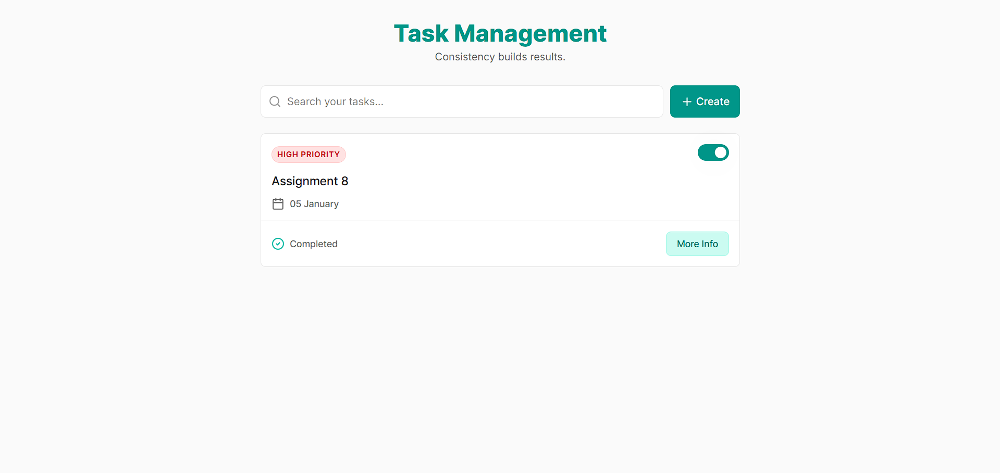

# Full Stack Task Management Application


## Introduction

A `Task Management Application` built using the `MERN stack (MongoDB, Express.js, React.js, Node.js)` that helps users create, manage, and track tasks efficiently. The application focuses on clean UI, backend with `MVC architecture`, and real-world `CRUD` functionality - making it suitable for both learning and production-ready demonstrations.

## Links

- `Frontend hosted on vercel`
  - Live Demo: https://task-management-lilac-one.vercel.app
- `Backend hosted on render`
  - Live Demo: https://task-management-jr6a.onrender.com/

## Project Preview Video

Click on image and watch demo video

[](https://vimeo.com/1151873165?share=copy&fl=sv&fe=ci)

## Tech Stack

### Frontend

- `Framework:` React.js (Hooks, Functional Components)
- `State Management:` Context API
- `Styling:` TailwindCSS and CSS Module
- `HTTP Request:` Axios
- `Routing:` React Router DOM
- `Icons:` Lucide React

### Backend

- `Runtime:` Node.js
- `Framework:` Express.js
- `Database:` MongoDB Atlas `(cloud based platform)`
- `ODM:` Mongoose
- `CORS:` (Cross-Origin Resource Sharing)
- `Environment Variable:` dotenv`(.env)` file

### DevOps & Tools

- `Version Control:` Git & GitHub
- `Deployment:` Frontend on `Vercel` and Backend on `Render`
- `Testing:` Postman

## Features

- Create, Read, Update, Delete `(CRUD)` Tasks
- Search support with `debouncing feature` (todos get latest first and searching case-insensitive)
- Task Status Management (Completed/Not Completed)
- Timestamped Tasks
- Clean & Responsive UI
- `MVC` (Model-View-Controller) Architecture
- RESTful API Architecture
- `DTO` (Data transfer Object) is a simple object used to `encapsulate and transfer data` between different layers.
- Full Stack MERN Implementation

## REST API Endpoints

| Method |         Endpoint         |             Description             |
| :----: | :----------------------: | :---------------------------------: |
|  GET   |       `/api/todos`       | Fetch all todos with search support |
|  GET   |    `/api/todos/{id}`     |      Fetch single todo details      |
|  POST  |      `/api/todos/`       |          Create a new todo          |
|  PUT   | `/api/todos/toggle/{id}` |   Update Status (`true or false`)   |
|  PUT   |    `/api/todos/{id}`     |         Update todo details         |
| DELETE |    `/api/todos/{id}`     |            Delete a todo            |

## Usage & Installation

### 1. Clone the Repository

```bash
git clone https://github.com/SharmaKumarRohit/Task-Management.git
cd Task-Management
```

### 2. Backend Setup

```bash
cd backend
npm install
```

#### Create a `.env` file on backend root folder and add:

```bash
PORT=8081
MONGO_URL=mongodb+srv://<db_user>:<db_password>@cluster0.wgvhanf.mongodb.net/todos
```

#### Start backend server:

```bash
npm run dev
```

### 3. Frontend Setup

```bash
cd frontend
npm install
npm run dev
```

## Developer Information

#### Rohit Kumar - Frontend & MERN Stack Developer

- [Linkedin](https://www.linkedin.com/in/rohit-kumar-4685252b6/)
- Email: sharmaeditx375@gmail.com
- [GitHub](https://github.com/SharmaKumarRohit/)

## Support

If you like this project, please consider giving it a ⭐ on GitHub. It helps a lots of motivation for further development.
